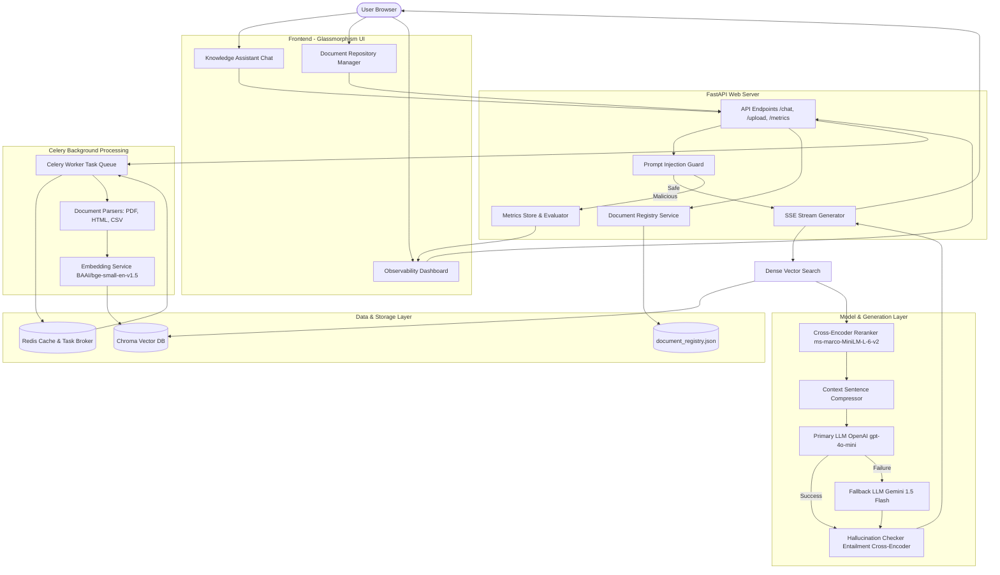

# Production-Grade RAG System

A highly scalable, secure, and observable Retrieval-Augmented Generation (RAG) assistant built with FastAPI, LangChain, Celery, Redis, ChromaDB, and multiple LLM providers (OpenAI/Gemini).

---

## 🚀 Key Upgrades (Round 2)
- **Multi-format Ingestion**: Support for PDF, HTML, and CSV via a robust Celery + Redis background processing pipeline.
- **Advanced Retrieval**: Utilizes `BAAI/bge-small-en-v1.5` for embeddings, `ms-marco-MiniLM-L-6-v2` for cross-encoder reranking, and contextual sentence compression.
- **Resilience & Security**: Fallback LLM generation (OpenAI -> Gemini), hallucination detection via cross-encoders, and Prompt Injection Defense guards.
- **Observability**: Live metrics dashboard tracking P95 latency, generation time, and error rates.
- **Dockerized**: Full one-command spin-up via `docker-compose`.

---

## 🏗 Architecture Diagram

The system operates as a decoupled RAG engine, separating query execution from document ingestion pipelines.



---

## 🌐 Working Deployed Application

> [!IMPORTANT]
> **Deployed Application URL**: `http://your-public-deployed-url.com` *(Candidate: Update this URL upon cloud deployment)*

---

## 📖 API Documentation

The FastAPI backend exposes the following API routes (fully documented via Swagger at `/docs`):

### 1. Document Management Router (`/upload`, `/documents`)

* **`POST /upload`**: Ingest a new document.
  * **Payload**: Form-data with file upload (`file: UploadFile`).
  * **Supported Formats**: `.pdf`, `.html`, `.htm`, `.csv`.
  * **Response**:
    ```json
    {
      "status": "success",
      "message": "File 'filename.pdf' uploaded and queued for processing.",
      "task_id": "celery-task-uuid"
    }
    ```
* **`GET /documents`**: List all uploaded and indexed files in the registry.
  * **Response**:
    ```json
    {
      "documents": [
        {
          "filename": "document.pdf",
          "document_type": "PDF",
          "status": "Indexed",
          "file_size": 124500,
          "page_count": 4,
          "chunk_count": 12,
          "error": null
        }
      ]
    }
    ```
* **`DELETE /document/{filename}`**: Delete a document and purge its vectors from ChromaDB.

### 2. Retrieval & Chat Router (`/chat`)

* **`POST /chat`**: Send queries and stream token responses.
  * **Headers**: `X-Session-ID: <session_uuid>` (Required for session memory persistence)
  * **Payload**:
    ```json
    {
      "question": "What is the P95 response latency of Fastigo?"
    }
    ```
  * **Stream Response (`text/event-stream`)**:
    * Yields pipeline phase updates (`Retrieving Documents...`, `Reranking Results...`, `Compressing Context...`, `Generating Answer...`).
    * Yields live performance stats (`type: pipeline`).
    * Streams tokens (`type: token`).
    * Yields citations with similarity scores (`type: citations`).
* **`POST /clear-session`**: Clear conversation memory.
* **`GET /history`**: Retrieve the conversation memory.

### 3. Observability & Monitoring Router (`/metrics`)

* **`GET /metrics`**: Retrieve metrics and security logs.
  * **Response**:
    ```json
    {
      "average_latency": 1.24,
      "p95_latency": 2.1,
      "error_rate": 0.0,
      "average_grounding_score": 0.95,
      "average_retrieval_precision": 0.854,
      "prompt_injections_blocked": 0,
      "security_events": [],
      "total_cost": 0.00045,
      "vector_chunks": 12,
      "documents_indexed": 1
    }
    ```

---

## 🛠 Setup Instructions

### 1. Configuration
Create a `.env` file from `.env.example`:
```env
OPENAI_API_KEY=sk-your-openai-key
GEMINI_API_KEY=AIzaSyYourGeminiKey
OPENAI_MODEL=gpt-4o-mini
GEMINI_MODEL=gemini-1.5-flash
```

### 2. Start the System (Docker Compose)
To spin up all services (Web backend, Redis broker, Celery worker), run:
```bash
docker-compose up --build
```
* **Chat UI**: `http://localhost:8000`
* **Observability Dashboard**: `http://localhost:8000/dashboard`
* **Swagger API Docs**: `http://localhost:8000/docs`

---

## 🔬 System Design Decisions

### Chunking Strategy
We use `RecursiveCharacterTextSplitter` with `chunk_size=1000` and `chunk_overlap=200`. This size ensures that chunks maintain semantic cohesion across paragraph boundaries without starving the LLM of context. Each chunk is tagged with deep metadata (`source_file`, `page_number`, `document_type`, `chunk_id`).

### Embedding Choice
`BAAI/bge-small-en-v1.5` was chosen for its top-tier position on the MTEB leaderboard for its size, offering better retrieval precision than standard MiniLM.

### Retrieval Strategy & Context Compression
We execute a **hybrid pipeline**:
1. Top 10 chunks retrieved via dense vector search.
2. Top 3 chunks reranked using the `cross-encoder/ms-marco-MiniLM-L-6-v2` to filter out contextually irrelevant keyword matches.
3. Chunks are compressed by extracting only sentences containing query terms, saving LLM tokens and reducing latency.

### Security Design
A `PromptGuard` intercepts the query before it hits the retrieval pipeline. It uses heuristics and sanitization rules to block jailbreak attempts (e.g., "ignore previous instructions").

### Hallucination Detection
We run the generated answer and the source context through the cross-encoder. If the entailment score drops below a safe threshold, a warning citation is appended to the stream notifying the user of a potential hallucination.

### Scalability
The ingestion layer was entirely decoupled. Uploads immediately return a Task ID while a Celery Worker handles the heavy OCR/Parsing/Embedding. This ensures the web server can handle 10,000+ documents without blocking the main event loop.

---

## 📋 Deliverables Checklist

- [x] **Architecture diagram**: Embedded in `README.md` via Mermaid.
- [x] **Source code repository**: Fully implemented structure.
- [ ] **Working deployed application/server link**: Placeholder added in `README.md` (Update upon cloud deployment).
- [x] **API documentation**: Documented in `README.md` and dynamically generated at `/docs`.
- [x] **Evaluation report**: Completed and documented in [evaluation_report.md](file:///c:/Users/Varun/Source/Repos/Projects/PDF%20-%20Based%20AI%20Chatbot%20Advance/evaluation_report.md).
- [x] **Setup and execution instructions**: Documented in `README.md`.
