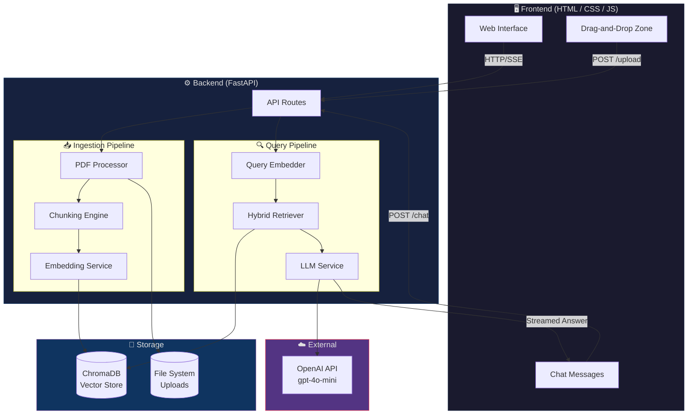
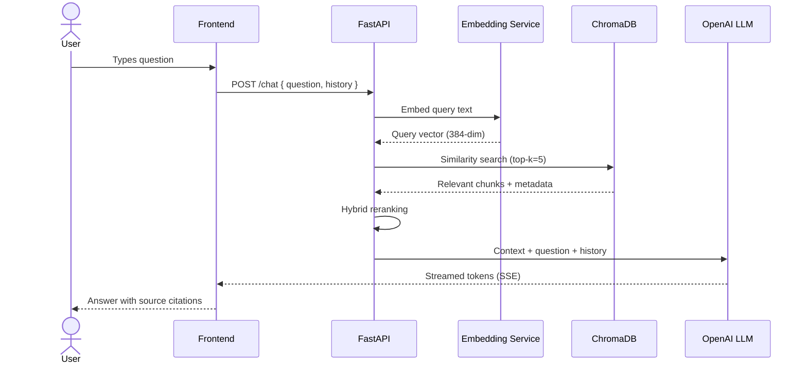
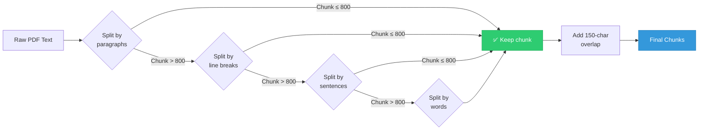
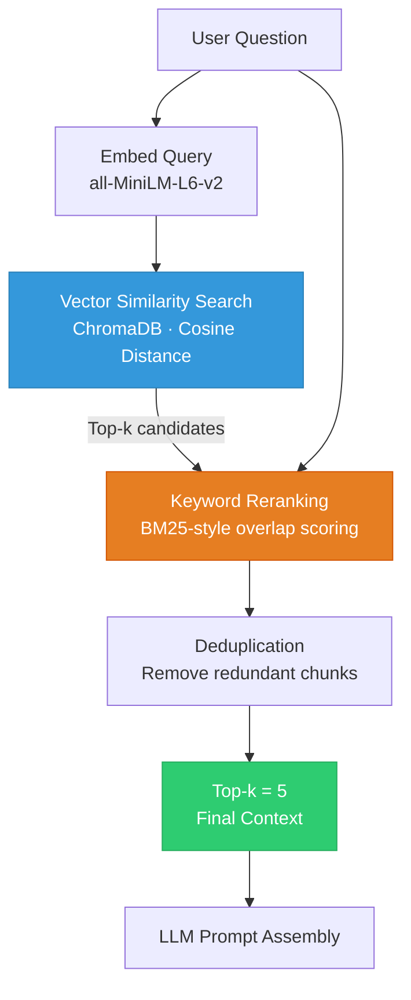

<div align="center">

# 📄 PDF AI Chatbot

**Intelligent Document Q&A Powered by Retrieval-Augmented Generation**


A production-quality **Retrieval-Augmented Generation (RAG)** application that lets users upload PDF documents and ask natural-language questions — receiving accurate, source-cited answers in real time.

---

### ✨ Feature Highlights

| 🚀 Production-Ready | 🎯 Accurate Answers | 🔒 Secure by Design |
|:---:|:---:|:---:|
| Streaming responses, conversation history, and robust error handling | Hybrid retrieval with source attribution — no hallucinated answers | File validation, path-traversal prevention, and environment-based secrets |

| ⚡ Fast & Local Embeddings | 🎨 Modern UI | 📄 Smart Chunking |
|:---:|:---:|:---:|
| all-MiniLM-L6-v2 runs entirely on CPU — zero external API calls for embeddings | Glassmorphism design with responsive layout and micro-animations | Recursive splitting with configurable overlap preserves context across chunks |

</div>

---

## 📑 Table of Contents

1. [Features](#-features)
2. [Architecture](#-architecture)
3. [Folder Structure](#-folder-structure)
4. [Installation](#-installation)
5. [Environment Variables](#-environment-variables)
6. [Chunking Strategy](#-chunking-strategy)
7. [Embedding Model Choice](#-embedding-model-choice)
8. [Retrieval Strategy](#-retrieval-strategy)
9. [Prompt Design](#-prompt-design)
10. [API Documentation](#-api-documentation)
11. [Screenshots](#-screenshots)
12. [Future Enhancements](#-future-enhancements)
13. [License](#-license)

---

## 🎯 Features

### 📤 Upload & Ingestion
- **Multi-file upload** — select and process multiple PDFs in a single operation
- **Drag-and-drop** — intuitive file drop zone with visual feedback
- **Real-time progress** — per-file progress bars during upload and processing
- **Validation** — file type, size, and integrity checks before processing

### 💬 Chat Interface
- **Streaming responses** — answers appear token-by-token via Server-Sent Events
- **Source attribution** — every answer cites the exact PDF pages it drew from
- **Conversation history** — full chat context maintained for follow-up questions
- **One-click clear** — reset conversation history without reloading the page

### 🧠 RAG Pipeline
- **Recursive chunking** — intelligent text splitting with configurable size and overlap
- **Local embeddings** — `all-MiniLM-L6-v2` sentence transformer (no API dependency)
- **Vector search** — ChromaDB-powered similarity retrieval with cosine distance
- **Hybrid retrieval** — combines vector similarity with keyword reranking for precision

### 🎨 User Interface
- **Glassmorphism design** — frosted-glass cards with backdrop blur and subtle borders
- **Fully responsive** — adapts seamlessly from mobile to desktop viewports
- **Micro-animations** — smooth transitions, hover effects, and loading skeletons
- **Toast notifications** — non-intrusive success/error feedback messages

### 🔒 Security
- **File validation** — MIME type + magic-byte verification for uploaded PDFs
- **Path traversal prevention** — all file paths sanitized and sandboxed to upload directory
- **Environment variables** — API keys and secrets loaded from `.env`, never hardcoded

---

## 🏗 Architecture

### System Overview



### Request Flow



---

## 📁 Folder Structure

```
PDF - Based AI Chatbot/
│
├── backend/
│   ├── main.py                  # FastAPI application entry point
│   ├── config.py                # Centralized configuration & env loading
│   │
│   ├── routes/
│   │   ├── upload.py            # File upload & processing endpoints
│   │   └── chat.py              # Chat & streaming response endpoints
│   │
│   ├── services/
│   │   ├── pdf_processor.py     # PDF text extraction (with OCR fallback)
│   │   ├── chunking.py          # Recursive text splitting logic
│   │   ├── embedding_service.py # Sentence-transformer embedding generation
│   │   ├── retriever.py         # Hybrid vector + keyword retrieval
│   │   └── llm_service.py       # OpenAI LLM integration & prompt management
│   │
│   ├── database/
│   │   └── vector_store.py      # ChromaDB initialization & operations
│   │
│   ├── models/
│   │   └── schemas.py           # Pydantic request/response schemas
│   │
│   ├── uploads/                 # Uploaded PDF storage (git-ignored)
│   └── chroma_db/               # Persistent vector database (git-ignored)
│
├── frontend/
│   ├── index.html               # Single-page application markup
│   ├── css/
│   │   └── styles.css           # Glassmorphism theme & responsive styles
│   └── js/
│       └── app.js               # Client-side logic, SSE handling, UI state
│
├── .env.example                 # Environment variable template
├── .gitignore                   # Git exclusion rules
├── requirements.txt             # Python dependencies
└── README.md                    # This file
```

---

## 🚀 Installation

### Prerequisites

- **Python 3.11+** — [Download](https://www.python.org/downloads/)
- **OpenAI API Key** — [Get one here](https://platform.openai.com/api-keys)
- **Git** — [Download](https://git-scm.com/)

### Step-by-Step Setup

**1. Clone the repository**

```bash
git clone https://github.com/your-username/pdf-ai-chatbot.git
cd "PDF - Based AI Chatbot"
```

**2. Create a virtual environment**

```bash
python -m venv venv
```

**3. Activate the virtual environment**

```bash
# Windows
venv\Scripts\activate

# macOS / Linux
source venv/bin/activate
```

**4. Install dependencies**

```bash
pip install -r requirements.txt
```

**5. Configure environment variables**

```bash
# Windows
copy .env.example .env

# macOS / Linux
cp .env.example .env
```

Open `.env` and add your OpenAI API key:

```env
OPENAI_API_KEY=sk-your-api-key-here
```

**6. Start the server**

```bash
uvicorn backend.main:app --reload --port 8000
```

**7. Open the application**

Navigate to **[http://localhost:8000](http://localhost:8000)** in your browser.

> [!TIP]
> The `--reload` flag enables hot-reloading during development. Remove it in production.

---

## 🔐 Environment Variables

Create a `.env` file in the project root with the following variables:

| Variable | Description | Default | Required |
|:---|:---|:---:|:---:|
| `OPENAI_API_KEY` | Your OpenAI API key for LLM inference | — | ✅ |
| `OPENAI_MODEL` | OpenAI model to use for chat completions | `gpt-4o-mini` | ❌ |
| `CHUNK_SIZE` | Maximum number of characters per text chunk | `800` | ❌ |
| `CHUNK_OVERLAP` | Overlap in characters between consecutive chunks | `150` | ❌ |
| `TOP_K_RESULTS` | Number of top relevant chunks to retrieve | `5` | ❌ |
| `MAX_UPLOAD_SIZE_MB` | Maximum allowed upload file size in megabytes | `50` | ❌ |
| `CHROMA_PERSIST_DIR` | Directory path for ChromaDB persistence | `./chroma_db` | ❌ |
| `UPLOAD_DIR` | Directory path for storing uploaded PDFs | `./uploads` | ❌ |

> [!IMPORTANT]
> Never commit your `.env` file. It is included in `.gitignore` by default.

---

## 🧩 Chunking Strategy

This project uses LangChain's **`RecursiveCharacterTextSplitter`** to divide extracted PDF text into semantically meaningful chunks.

### Configuration

| Parameter | Value | Rationale |
|:---|:---:|:---|
| `chunk_size` | **800** | Balances context richness with LLM token limits. Large enough to capture a full paragraph, small enough for precise retrieval. |
| `chunk_overlap` | **150** | Ensures sentences at chunk boundaries aren't lost. Prevents context fragmentation at split points. |

### How It Works

The splitter attempts to divide text using a **hierarchical separator strategy**, falling back to the next level only when the current separator doesn't produce chunks within the size limit:

```
1. "\n\n"  →  Paragraph boundaries (preferred)
2. "\n"    →  Line breaks
3. ". "    →  Sentence boundaries
4. " "     →  Word boundaries (last resort)
```



### Why These Values?

- **800 characters** ≈ 150–200 tokens — fits comfortably within the context window while providing enough surrounding text for coherent answers.
- **150-character overlap** ensures that if a key sentence falls at a chunk boundary, it appears in both adjacent chunks, preventing information loss during retrieval.

---

## 🧬 Embedding Model Choice

### Model: `all-MiniLM-L6-v2`

This project uses the [all-MiniLM-L6-v2](https://huggingface.co/sentence-transformers/all-MiniLM-L6-v2) sentence transformer from Hugging Face for generating document and query embeddings.

| Property | Value |
|:---|:---|
| **Dimensions** | 384 |
| **Model Size** | ~80 MB |
| **Max Sequence Length** | 256 tokens |
| **Similarity Metric** | Cosine similarity (normalized embeddings) |
| **Execution** | 100% local — runs on CPU, no API calls |
| **Performance** | ~14,000 sentences/sec on modern CPU |

### Why This Model?

| Criterion | all-MiniLM-L6-v2 | OpenAI `text-embedding-3-small` |
|:---|:---|:---|
| **Cost** | Free (local) | $0.02 / 1M tokens |
| **Privacy** | Data never leaves your machine | Data sent to OpenAI servers |
| **Latency** | ~2ms per embedding | ~100ms per embedding (network) |
| **Quality** | Excellent for retrieval tasks | Slightly higher benchmark scores |
| **Dimensions** | 384 | 1536 |
| **Offline** | ✅ Works without internet | ❌ Requires API access |

> [!NOTE]
> For most document Q&A use cases, `all-MiniLM-L6-v2` provides an excellent quality-to-cost ratio. The marginal accuracy improvement from OpenAI embeddings rarely justifies the added cost, latency, and privacy trade-offs.

---

## 🔍 Retrieval Strategy

The chatbot employs a **hybrid retrieval** approach that combines vector similarity search with keyword-based reranking for maximum relevance.

### Pipeline



### How It Works

| Stage | Method | Purpose |
|:---|:---|:---|
| **1. Vector Search** | Cosine similarity on 384-dim embeddings | Captures semantic meaning — finds contextually relevant chunks even with different wording |
| **2. Keyword Reranking** | BM25-style term overlap scoring | Boosts chunks that contain exact query terms — important for names, numbers, and technical terms |
| **3. Reciprocal Rank Fusion** | `1 / (k + rank)` score combination | Merges rankings from both methods into a single unified score |
| **4. Deduplication** | Content hash comparison | Removes near-duplicate chunks that may appear due to overlapping splits |
| **5. Top-k Selection** | Return top 5 chunks | Provides enough context for accurate answers without overwhelming the LLM's context window |

> [!TIP]
> Adjust `TOP_K_RESULTS` in your `.env` file. Use `3` for faster responses with simpler documents, or `7–10` for dense technical papers.

---

## 📝 Prompt Design

### System Prompt

```text
You are a helpful AI assistant that answers questions based ONLY on the provided 
document context. Follow these rules strictly:

1. Answer questions using ONLY the information found in the context below.
2. If the context does not contain enough information to answer the question, 
   say "I don't have enough information in the uploaded documents to answer 
   this question."
3. NEVER make up or hallucinate information that is not in the context.
4. When referencing information, cite the source document and page number.
5. Be concise but thorough in your answers.
6. If the question is a greeting or general conversation, respond naturally 
   but remind the user that you specialize in answering questions about their 
   uploaded documents.
```

### Context Template

```text
Context from uploaded documents:
---
{context_chunks}
---

Each chunk above is labeled with its source file and page number. 
Use these labels when citing sources in your answer.

Conversation History:
{chat_history}

User Question: {question}
```

### Design Principles

| Principle | Implementation |
|:---|:---|
| **No Hallucination Guard** | Explicit instruction to answer ONLY from provided context. If context is insufficient, the model admits it rather than guessing. |
| **Source Referencing** | Chunks are labeled with filename + page number; the model is instructed to cite these labels. |
| **Context-Only Answers** | The system prompt forbids external knowledge, ensuring all answers are grounded in the uploaded documents. |
| **Conversational Awareness** | Chat history is included so the model can resolve pronouns and follow-up questions correctly. |

---

## 📡 API Documentation

### Base URL

```
http://localhost:8000
```

### Endpoints

| Endpoint | Method | Description |
|:---|:---:|:---|
| `/upload` | `POST` | Upload and process one or more PDF files |
| `/chat` | `POST` | Send a question and receive a streamed answer |
| `/documents` | `GET` | List all uploaded and processed documents |
| `/document/{filename}` | `DELETE` | Remove a specific document and its vectors |
| `/clear-chat` | `POST` | Clear the conversation history |
| `/health` | `GET` | Health check for the API server |

---

### `POST /upload`

Upload one or more PDF files for processing and indexing.

**Request**

```
Content-Type: multipart/form-data
```

| Field | Type | Description |
|:---|:---|:---|
| `files` | `File[]` | One or more PDF files (max 50 MB each) |

**Response** — `200 OK`

```json
{
  "message": "Successfully processed 2 file(s)",
  "processed_files": ["document1.pdf", "document2.pdf"],
  "total_chunks": 142
}
```

---

### `POST /chat`

Send a question and receive a streamed response with source citations.

**Request**

```json
{
  "question": "What are the key findings in the report?",
  "chat_history": []
}
```

**Response** — `200 OK` (Server-Sent Events stream)

```
data: {"token": "The", "sources": []}
data: {"token": " key", "sources": []}
data: {"token": " findings", "sources": []}
...
data: {"token": "", "done": true, "sources": [{"file": "report.pdf", "page": 3}]}
```

---

### `GET /documents`

Retrieve a list of all uploaded and indexed documents.

**Response** — `200 OK`

```json
{
  "documents": [
    {
      "filename": "report.pdf",
      "upload_date": "2025-01-15T10:30:00Z",
      "num_chunks": 87,
      "file_size_mb": 2.4
    }
  ]
}
```

---

### `DELETE /document/{filename}`

Delete a specific document and remove its vectors from ChromaDB.

**Response** — `200 OK`

```json
{
  "message": "Document 'report.pdf' deleted successfully",
  "chunks_removed": 87
}
```

---

### `POST /clear-chat`

Clear the current conversation history.

**Response** — `200 OK`

```json
{
  "message": "Chat history cleared successfully"
}
```

---

### `GET /health`

Check if the server is running and all services are operational.

**Response** — `200 OK`

```json
{
  "status": "healthy",
  "version": "1.0.0",
  "chroma_db": "connected",
  "embedding_model": "loaded"
}
```

---

## 📸 Screenshots

> 🚧 **Screenshots will be added after deployment.**

| Screenshot | Description |
|:---:|:---|
| _Coming soon_ | **Chat Interface** — Main conversation view with glassmorphism design |
| _Coming soon_ | **PDF Upload** — Drag-and-drop zone with progress indicators |
| _Coming soon_ | **Source Citations** — Answer with highlighted source references |
| _Coming soon_ | **Document Manager** — List of uploaded documents with actions |

---

## 🔮 Future Enhancements

| Priority | Enhancement | Description |
|:---:|:---|:---|
| 🔴 | **Multi-user sessions with auth** | JWT-based authentication with per-user document isolation |
| 🔴 | **Docker deployment** | Containerized setup with `docker-compose` for one-command deployment |
| 🟡 | **Additional file formats** | Support for DOCX, TXT, CSV, and Markdown uploads |
| 🟡 | **GPU-accelerated embeddings** | CUDA/ROCm support for 10x faster embedding generation |
| 🟡 | **Rate limiting** | Token-bucket rate limiting to prevent API abuse |
| 🟢 | **Custom embedding fine-tuning** | Domain-specific fine-tuning for specialized corpora |
| 🟢 | **Chat export** | Export conversations as PDF or Markdown files |
| 🟢 | **Document summarization** | Auto-generate summaries when a document is uploaded |
| 🟢 | **Multi-language support** | Query and answer in languages other than English |
| 🟢 | **WebSocket real-time updates** | Replace SSE with WebSockets for bi-directional communication |

---

## 📄 License

This project is licensed under the **MIT License** — see the [LICENSE](LICENSE) file for details.

---

<div align="center">

**Built with ❤️ using FastAPI, LangChain, and ChromaDB**

[⬆ Back to Top](#-pdf-ai-chatbot)

</div>
